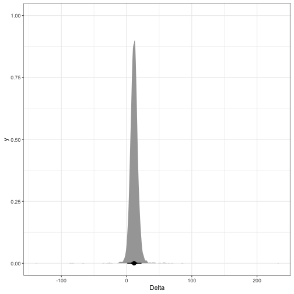
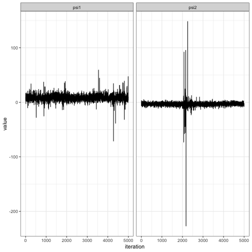

We illustrate the usage of Dirichlet process mixture models to model
longitudinal outcome data subject to informative missingness. The observed data
model considered here is of the form

$$
  Z_i \sim \text{Categorical}(\omega),
$$

$$
  R_{i1} \equiv 1,
$$

$$
  [Y_{i1} \mid Z_i] \sim N(\mu^{(Z_i)}_1, \sigma^{2(Z_i)}_1),
$$

$$
  \mbox{logit}\Pr(R_{i(j+1)} = 1 \mid R_{ij} = 1, \overline{Y}_{i(j-1)}, {Z_i}) =  \zeta_{j}^{(Z_i)} + \gamma_{j1}^{(Z_i)} Y_{ij}  + \gamma_{j2}^{(Z_i)} Y_{i(j-1)},
$$

$$
  [Y_{ij} \mid R_{ij} = 1, 
  \overline{Y}_{i(j-1)}, Z_i] 
  \sim 
    N\left\{\mu_j^{(Z_i)} + 
        \sum_{\ell = 1}^{j-1} \phi_{j\ell}^{(Z_i)}(Y_{i\ell} - \mu_\ell^{(Z_i)}),
        \sigma^2\right\}
$$

While this model does not account for any predictors, we note that it is
possible to account for continuous pretreatment predictors by prepending them to
the vector $Y_i = (Y_{i1}, \ldots, Y_{iJ})$ of outcome variables (discrete
variables can be allowed through stratification as well).

First, we load the package and the **tidyverse** package:


```r
library(CausalBNPBook)
library(tidyverse)
library(tidybayes)
```

We will illustrate using the `GH` dataset, which contains (in each row)
measurements of muscle strength in response to different growth hormone
treatments in elderly patients. We load the data and then extract the outcomes
corresponding to two treatments `trt = 1` and `trt = 2`:


```r
data(GH)
Y1 <- GH %>% filter(trt == 1) %>% select(Y1:Y3) %>% as.matrix()
Y2 <- GH %>% filter(trt == 2) %>% select(Y1:Y3) %>% as.matrix()
```

Next, we fit the Dirichlet process mixture of multivariate normal models to the
two treatment arms separately, using $K = 20$ mixture components in the
truncated DIrichlet process mixture:


```r
set.seed(209834)

fit_dpmn_1 <- FitDPMN(Y1, K = 20)
fit_dpmn_2 <- FitDPMN(Y2, K = 20)
```

The `FitDPMN` function returns objects of class `runjags` from the **runjags**
package; see
[here](https://cran.r-project.org/web/packages/runjags/vignettes/quickjags.html)
for quick tutorial on the **runjags** package, which uses
[JAGS](https://mcmc-jags.sourceforge.io/) to fit the Dirichlet process mixture
model. See `?FitDPMN` for options controlling the number of burnin iterations,
thinning interval, and total number of samples collected. Next, we run the
$g$-computation algorithm to generate samples of the causal parameters
$\psi_z = E(Y_{iJ} \mid \texttt{trt} = z)$.


```r
set.seed(9930)

gcomp_dpmn_1 <- GCompDPMN(fit_dpmn_1, Y = Y1, K = 20)
gcomp_dpmn_2 <- GCompDPMN(fit_dpmn_2, Y = Y2, K = 20)
```

See `?GCompDPMN` for details on how to implement the location-shift sensitivity
analysis described in the book (essentially, one just supplies a matrix of
sensitivity parameters `sens.param` of size $M \times J$ where the
$(m,j)^{\texth{th}}$ is a value of $\xi_j$ to use at iteration $m$).

The `GCompDPMN` function returns a list object containing samples following:

- `means`: the mean parameters $E(Y_{ij})$ for each treatment and time.
- `var_of_mean`: the Monte Carlo variance from the $g$-computation.
- `obs.means`: the observed data mean at each time (useful for model checking).
- `drop.probs`: the probability of dropout at each time (useful for model checking).
- `haz`: the hazard of dropout at each time (useful for model checking).
- `drop.probs`: the cumulative probability of dropout at each time, i.e., $\Pr(R_{ij} = 1, R_{i(j+1}) = 0)$ (useful for model checking).
- `change_from_baseline`: the change from baseline $E(Y_{iJ} - Y_{i1})$.
- `change_from_baseline_var:` the Monte Carlo variance of the change from baseline.

We can then get a _difference in difference_ estimate of the treatment effect as
follows:


```r
post_samps <- tibble(
  iteration = seq_len(nrow(gcomp_dpmn_1$means)),
  psi1 = gcomp_dpmn_1$change_from_baseline[,1],
  psi2 = gcomp_dpmn_2$change_from_baseline[,1],
  Delta = gcomp_dpmn_1$change_from_baseline - gcomp_dpmn_2$change_from_baseline
)

ggplot(post_samps, aes(x = Delta)) + stat_halfeye() + theme_bw()
```



In this case, we find that there is evidence for a positive effect of the
treatment on the outcome:


```r
mean(post_samps$Delta > 0)
```

```
## [1] 0.9812
```

and both chains seem to mix reasonable well:


```r
post_samps %>% 
  pivot_longer(cols = c(psi1, psi2), names_to = "Parameter") %>%
  ggplot(aes(x = iteration, y = value)) + 
  geom_line() + 
  facet_wrap(~Parameter) + 
  theme_bw()
```



