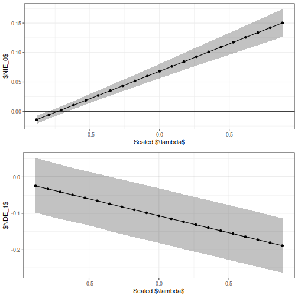

# The Mediation Model

We use the following model for the potential outcomes in the mediation analysis
problem:

$$
  Y_i(a,m) = \mu(m, a, X_i) + \epsilon_i, \qquad \epsilon_i \sim N(0, \sigma^2_\epsilon)
$$

$$
  M_i(a) = \mu(a, X_i) + \nu_i, \qquad \nu_i \sim N(0, \sigma^2_\nu).
$$

We use a non-stratified mediation model in this case, i.e., we use the treatment
as a "regular covariate" in the model. The process for inference when we
stratify by treatment is similar, but we instead use the `mediate_bart_stratify`
and `mediate_bart_stratify_sensitivity` functions in place of the `mediate_bart`
and `mediate_bart_sensitivity` functions.

# Necessary Software

We use the __BartMediate__ package for this analysis, which is available at the
Github repository of the same name. Prior to installing the package, it is
required to install the __bartMachine__ package (available on CRAN). Prior to
installing __bartMachine__, we also need to have a working installation of Java
as well as the __rJava__ package, which is also available on CRAN. So, we would
install everything as follows:


```r
## FIRST: INSTALL JAVA
## SECOND: INSTALL REQUIRED PACKAGES
install.packages("rJava")
install.packages("bartMachine")

## THIRD: INSTALL BARTMEDIATE
devtools::install_github("theodds/bartmediate", subdir = "BartMediate")
```

Install Java and __rJava__ can be a bit tricky; please see the [bartMachine
Github repository for more details on how to do
this.](https://github.com/kapelner/bartMachine/)

After doing this, we can load the packages:


```r
options(java.parameters = "-Xmx16g")
library(BartMediate)
library(tidyverse)
library(tidybayes)
```

# Preprocessing the Data

Next, we preprocess the data. We use a slightly different subset of the MEPS
dataset:


```r
meps_file <- "https://github.com/theodds/2023-ENAR-BNPCI/raw/master/meps2011.csv"
meps_logy <- read.csv(meps_file) %>% 
  filter(totexp > 0) %>% 
  mutate(logY = log(totexp)) %>% 
  mutate(smoke = ifelse(smoke == "No", 0, 1)) %>% 
  select(-totexp) %>% select(logY, everything())

phealth <- meps_logy$phealth
phealth <- case_when(phealth == "Poor" ~ 1, phealth == "Fair" ~ 2, 
                     phealth == "Good" ~ 3, phealth == "Very Good" ~ 4, 
                     phealth == "Excellent" ~ 5)
meps_logy$phealth <- phealth
rm(phealth)
```

# Getting the Clever Covariates

As a preprocessing step, we require both estimates of the propensity score and
the mediator regression function; we use the following code to obtain these.


```r
fitted_smoking <- bartMachine(
  X = meps_logy %>% select(-logY, -smoke, -phealth) %>% as.data.frame(),
  y = factor(meps_logy$smoke),
  num_burn_in = 4000,
  num_iterations_after_burn_in = 4000,
  mem_cache_for_speed = FALSE,
  seed = 1,
  serialize = TRUE
)
```

```
## Warning in build_bart_machine(X, y, Xy, num_trees, num_burn_in,
## num_iterations_after_burn_in, : covariate prior vector length =
## 10 has to be equal to p = 27 (the vector was lengthened and
## evenly distributed the weights)
```

```r
# First Clever Covariate
propensity_scores <- fitted_smoking$p_hat_train
```


```r
fitted_mediator <- bartMachine(
  X = meps_logy %>% select(-logY, -phealth) %>%
    mutate(propensity = propensity_scores) %>% as.data.frame(),
  y = meps_logy$phealth,
  num_burn_in = 4000,
  num_iterations_after_burn_in = 4000,
  mem_cache_for_speed = FALSE,
  seed = 2,
  serialize = TRUE
)
```

```
## Warning in build_bart_machine(X, y, Xy, num_trees, num_burn_in,
## num_iterations_after_burn_in, : covariate prior vector length =
## 12 has to be equal to p = 29 (the vector was lengthened and
## evenly distributed the weights)
```

```r
# Second Clever Covariate
health_hat_0 <- predict(
  fitted_mediator, 
  meps_logy %>% select(-logY, -phealth) %>%
  mutate(propensity = propensity_scores, smoke = 0) %>% as.data.frame()
)

# Third Clever Covariate
health_hat_1 <- predict(
  fitted_mediator, 
  meps_logy %>% select(-logY, -phealth) %>%
  mutate(propensity = propensity_scores, smoke = 1) %>% as.data.frame()
)
```

# Adding the Clever Covariates to the Data

Before fitting the final models using `bartMachine`, we add the clever
covariates to the datasets:


```r
meps_outcome <- meps_logy %>% 
  select(-logY) %>%
  mutate(propensity = propensity_scores, health_hat_0 = health_hat_0,
         health_hat_1 = health_hat_1)
```

# Fitting the Outcome Regression Models

We already computed the required mediator regression model in the process of
computing the clever covariate; all that is left now is to compute the outcome
regression and perform the mediation analysis, which we do now:


```r
fitted_outcome <- bartMachine(
  X = meps_outcome %>% as.data.frame(),
  y = meps_logy$logY,
  num_burn_in = 4000,
  num_iterations_after_burn_in = 4000,
  seed = 3,
  mem_cache_for_speed = FALSE,
  serialize = TRUE
)
```

```
## Warning in build_bart_machine(X, y, Xy, num_trees, num_burn_in,
## num_iterations_after_burn_in, : covariate prior vector length =
## 15 has to be equal to p = 32 (the vector was lengthened and
## evenly distributed the weights)
```

The mediation is handled using the function `mediate_bart`, which computes the
average direct and indirect effects using the $g$-formula described by [Imai et
al.](https://imai.fas.harvard.edu/research/files/BaronKenny.pdf)


```r
set.seed(4)
mediated_bart <- mediate_bart(
  fit_y = fitted_outcome, 
  fit_m = fitted_mediator, 
  design_y = meps_outcome %>% as.data.frame(), 
  design_m = meps_logy %>% 
    select(-logY, -phealth) %>%
    mutate(propensity = propensity_scores) %>% as.data.frame(), 
  trt_name = "smoke", med_name = "phealth", 
  iters = seq(from = 1, to = 4000, by = 4), 
  num_copy = 2
)
```

Next, we visualize the posterior distribution using the __tidybayes__ package to
get interval estimates of the direct and indirect effects.


```r
plot_mediated <- mediated_bart %>% 
  mutate(ParamName = case_when(ParamName == "zeta_1" ~ "$NDE_1$", 
                               ParamName == "zeta_0" ~ "$NDE_0$", 
                               ParamName == "delta_1" ~ "$NIE_1$", 
                               ParamName == "delta_0" ~ "$NIE_0$", 
                               ParamName == "tau" ~ "$TE$"))

p <- ggplot(plot_mediated, aes(x = Param, y = ParamName)) + stat_halfeye() + 
  theme_bw() + xlab("Value") + ylab("Parameter") + theme_bw()

print(p)
```


# Sensitivity Analysis

 To assess sensitivity to the sequential ignorability assumption, in Chapter 14
 we introduced a sensitivity parameter $\lambda$ that captures correlation
 between the potential outcomes $M_i(a)$ and $Y_i(a,m)$ that is _not_ captured
 by the measured confounders. Specifically, a term of the form $\lambda \{M_i(a) - m\}$ in the regression model for $Y_i(a,m)$.
 
 The `mediate_bart_sensitivity` function can be used for this purpose as
 follows:
 

```r
set.seed(6)
mediated_bart <- mediate_bart_sensitivity(
  fit_y = fitted_outcome,
  fit_m = fitted_mediator,
  design_y = meps_outcome %>% as.data.frame(),
  design_m = meps_logy %>%
    select(-logY, -phealth) %>%
    mutate(propensity = propensity_scores) %>% as.data.frame(),
  trt_name = "smoke",
  med_name = "phealth",
  iters = seq(from = 1, to = 4000, by = 4),
  num_copy = 2
)
```


```r
head(mediated_bart)
```

```
##   Iteration CopyID       Param ParamName
## 1         1      1  0.05789532   delta_0
## 2         1      1  0.05789532   delta_1
## 3         1      1 -0.08702991    zeta_0
## 4         1      1 -0.08702991    zeta_1
## 5         1      1 -0.02913459       tau
## 6         1      1 -0.25146822   theta_a
```

As noted in the chapter, sensitivity analysis in this model can be done in
parallel for all values of $\lambda$ from the same MCMC run. We first aggregate
the output of `mediate_bart_sensitivity`.


```r
mediated_bart_agg <- mediated_bart %>% group_by(Iteration, ParamName) %>%
  summarise(Param = mean(Param)) %>% 
  pivot_wider(names_from = ParamName, values_from = Param)
```

```
## `summarise()` has grouped output by 'Iteration'. You can override
## using the `.groups` argument.
```

```r
head(mediated_bart_agg)
```

```
## # A tibble: 6 × 7
## # Groups:   Iteration [6]
##   Iteration delta_0 delta_1     tau theta_a  zeta_0  zeta_1
##       <dbl>   <dbl>   <dbl>   <dbl>   <dbl>   <dbl>   <dbl>
## 1         1  0.0564  0.0564 -0.0306  -0.251 -0.0870 -0.0870
## 2         5  0.0686  0.0686  0.0106  -0.291 -0.0580 -0.0580
## 3         9  0.0682  0.0682 -0.0130  -0.279 -0.0812 -0.0812
## 4        13  0.0641  0.0641 -0.0326  -0.253 -0.0967 -0.0967
## 5        17  0.0709  0.0709 -0.0461  -0.291 -0.117  -0.117 
## 6        21  0.0725  0.0725  0.0455  -0.289 -0.0270 -0.0270
```

```r
shift_lambda <- function(lambda) {
  out <- mediated_bart_agg %>%
    mutate(delta_0 = delta_0 - lambda * theta_a,
           delta_1 = delta_1 - lambda * theta_a,
           zeta_0 = zeta_0 + lambda * theta_a,
           zeta_1 = zeta_1 + lambda * theta_a,
           lambda = lambda)
  return(out)
}

lambda_grid <- seq(from = -.3, to = .3, length = 21)

mediated_sa <- do.call(rbind, lapply(lambda_grid, shift_lambda))
head(mediated_sa)
```

```
## # A tibble: 6 × 8
## # Groups:   Iteration [6]
##   Itera…¹ delta_0 delta_1     tau theta_a   zeta_0   zeta_1 lambda
##     <dbl>   <dbl>   <dbl>   <dbl>   <dbl>    <dbl>    <dbl>  <dbl>
## 1       1 -0.0190 -0.0190 -0.0306  -0.251 -0.0116  -0.0116    -0.3
## 2       5 -0.0188 -0.0188  0.0106  -0.291  0.0294   0.0294    -0.3
## 3       9 -0.0154 -0.0154 -0.0130  -0.279  0.00243  0.00243   -0.3
## 4      13 -0.0117 -0.0117 -0.0326  -0.253 -0.0209  -0.0209    -0.3
## 5      17 -0.0165 -0.0165 -0.0461  -0.291 -0.0296  -0.0296    -0.3
## 6      21 -0.0140 -0.0140  0.0455  -0.289  0.0596   0.0596    -0.3
## # … with abbreviated variable name ¹​Iteration
```

Finally, we summarize the results and plot the posterior distributions using the __tidybayes__ package:


```r
mediated_summary <- mediated_sa %>%
  group_by(lambda) %>%
  summarise_all(list(mean, function(x) quantile(x, 0.025), 
                     function(x) quantile(x, 0.975))) %>%
  select(-Iteration_fn1) %>%
  rename(delta_0 = "delta_0_fn1", ymin = "delta_0_fn2", ymax = "delta_0_fn3") %>%
  select(lambda, delta_0, ymin, ymax)

mediated_summary_zeta <- mediated_sa %>%
  group_by(lambda) %>%
  summarise_all(list(mean, function(x) quantile(x, 0.025), 
                     function(x) quantile(x, 0.975))) %>%
  select(-Iteration_fn1) %>%
  rename(zeta_1 = "zeta_1_fn1", ymin = "zeta_1_fn2", ymax = "zeta_1_fn3") %>%
  select(lambda, zeta_1, ymin, ymax)

pp <- ggplot(mediated_summary, aes(x = lambda / 0.34, y = delta_0)) +
  geom_ribbon(aes(ymin = ymin, ymax = ymax), alpha = 0.3) +
  theme_bw() + xlab("Scaled $\\lambda$") + ylab("$NIE_0$") +
  geom_point() + geom_line() + geom_hline(yintercept = 0)

pp2 <- ggplot(mediated_summary_zeta, aes(x = lambda / 0.34, y = zeta_1)) +
  geom_ribbon(aes(ymin = ymin, ymax = ymax), alpha = 0.3) +
  theme_bw() + xlab("Scaled $\\lambda$") + ylab("$NDE_1$") +
  geom_point() + geom_line() + geom_hline(yintercept = 0)

gridExtra::grid.arrange(pp, pp2, nrow = 2)
```




