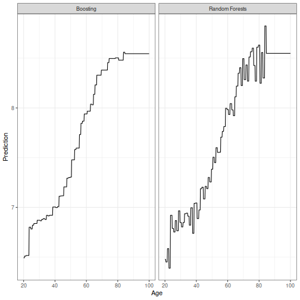
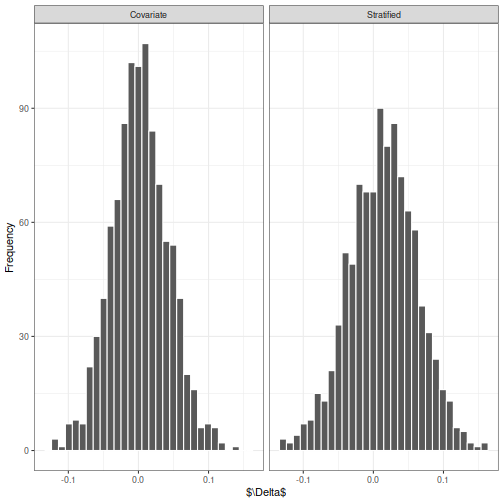
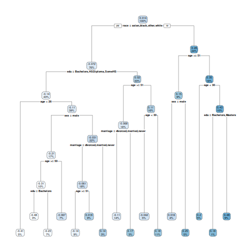

This notebook reproduces some of the Figures displayed in Chapter 5 (tree-based
methods and Bayesian additive regression trees). First, we load required
packages.


```r
library(CausalBNPBook)
library(tidyverse)
library(splines)
library(BART)
library(rpart)
library(rpart.plot)
library(xgboost)
library(randomForest)
library(gbm)
```

We use a subset of the MEPS dataset that is included in the __CausalBNPBook__
package:


```r
data(meps)

meps <- meps %>% as_tibble %>% mutate(y = log(y))
meps_age <- meps %>% select(age, y)
meps_age_test <- tibble(age = seq(from = min(meps$age),
                                  to = max(meps$age),
                                  length = 200))
```

# Reproducing Figure 5.6

The following code fits a CART model (using the __rpart__ package) and a BART
model (using the __BART__) package. Results are then compared for predicting log
medical expenditures from age on MEPS.


```r
set.seed(19084)

fitted_cart <- rpart(y ~ age, data = meps_age, cp = .001)
meps_age_test$cart_pred <- predict(fitted_cart, meps_age_test)

## Fit BART ----

fitted_bart <- wbart(x.train = select(meps_age, -y) %>% as.data.frame(),
                     y.train = meps_age$y,
                     x.test = meps_age_test %>% as.data.frame())
```

The following plots the results


```r
meps_age_test$bart_pred <- fitted_bart$yhat.test.mean

p_1 <- ggplot(meps_age_test, aes(x = age, y = cart_pred)) +
  geom_line() +
  xlab("Age") +
  ylab("CART Prediction") +
  theme_bw()

p_2 <- ggplot(meps_age_test, aes(x = age, y = bart_pred)) +
  geom_line() +
  xlab("Age") +
  ylab("BART Prediction") +
  theme_bw()

gridExtra::grid.arrange(p_1, p_2, nrow = 1)
```


# Reproducing Figure 5.8

Next, we reproduce Figure 5.8, which compares the predictions from a random
forest to the predictions from an ensemble of decision trees fit through
gradient boosting. The same subset of MEPS is used. We first fit the models.


```r
set.seed(843592734)

test_df <- tibble(age = seq(from = 20, to = 100, length = 500))

## Fit RF ----

fitted_rf <- randomForest(x = meps %>% select(age), y = meps$y)
pred_rf <- predict(fitted_rf, test_df)

## Fit boosting ----

fitted_boost <- gbm(y ~ age, data = meps, distribution = "gaussian")
pred_boost <- predict(fitted_boost, test_df, n.trees = 200)
```

We then use __tidyverse__ to plot the results:


```r
results_df <- tibble(age = rep(test_df$age,2),
                     fage = c(pred_rf, pred_boost),
                     method = rep(c("Random Forests", "Boosting"),
                                  each = nrow(test_df)))

ggplot(results_df, aes(x = age, y = fage)) +
  geom_line() +
  facet_wrap(~method) +
  xlab("Age") +
  ylab("Prediction") +
  theme_bw()
```



# Reproducing Figure 5.9

Finally, we show how to reproduce Figure 5.9, which contains the posterior
distribution of the average causal effect (ACE) of medical expenditures on
smoking. We first preprocess the data a little:


```r
meps_causal <- meps %>%
  as_tibble %>%
  mutate(sex = factor(sex), race = factor(race),
         marriage = factor(marriage), seat_belt = factor(seat_belt),
         edu = factor(edu))

meps_test_0 <- meps_causal %>% mutate(smoke = 0) %>% select(-y)
meps_test_1 <- meps_causal %>% mutate(smoke = 1) %>% select(-y)
meps_test_01 <- rbind(meps_test_0, meps_test_1)
```

Next, we fit the BART model treating smoking as a covariate using the __BART__
package:


```r
set.seed(398043)
bart_with_covariates <- wbart(x.train = meps_causal %>%
                                select(-y) %>% as.data.frame(),
                              y.train = meps$y,
                              x.test = meps_test_01 %>% as.data.frame())
```

Compare this with fitting the BART model by _stratifying_ on smoking:


```r
set.seed(398043)
meps_train_0 <- meps_causal %>% filter(smoke == 0) %>%
  select(-y, -smoke) %>% as.data.frame()
meps_train_1 <- meps_causal %>% filter(smoke == 1) %>%
  select(-y, -smoke) %>% as.data.frame()
bart_fit_0 <- wbart(x.train = meps_train_0,
                    y.train = meps_causal$y[meps$smoke == 0],
                    x.test = as.data.frame(meps_test_0)
)
bart_fit_1 <- wbart(x.train = meps_train_1,
                    y.train = meps_causal$y[meps$smoke == 1],
                    x.test = as.data.frame(meps_test_1))
```

Note that in both cases, we get predictions for all individuals whether they
smoked (`smoke == 1`) or not (`smoke == 0`). Next, we sample the weights of the
Bayesian bootstrap, and use the weights to compute the average of the potential
outcomes for both treatments and methods:


```r
set.seed(3809384)

bb_weight <- MCMCpack::rdirichlet(n = nrow(bart_with_covariates$yhat.test),
                                  alpha = rep(1,nrow(meps)))

mean_0 <- rowSums(bb_weight * bart_with_covariates$yhat.test[,1:nrow(meps)])
mean_1 <- rowSums(bb_weight * bart_with_covariates$yhat.test[,-(1:nrow(meps))])

mean_0_strat <- rowSums(bb_weight * bart_fit_0$yhat.test)
mean_1_strat <- rowSums(bb_weight * bart_fit_1$yhat.test)
```

Lastly, we compute the ACE for both methods and compute the causal effects!


```r
effect_est <- mean_1 - mean_0
effect_est_strat <- mean_1_strat - mean_0_strat

df_to_plot <- tibble(
  effect = c(effect_est, effect_est_strat),
  method = rep(c("Covariate", "Stratified"), each = length(effect_est))
)

ggplot(df_to_plot, aes(x = effect)) +
  geom_histogram(color = 'white') +
  facet_wrap(~method) +
  xlab("$\\Delta$") +
  ylab("Frequency") +
  theme_bw()
```

```
## `stat_bin()` using `bins = 30`. Pick better value with
## `binwidth`.
```



```r
print(mean(effect_est > 0))
```

```
## [1] 0.523
```

```r
print(mean(effect_est_strat > 0))
```

```
## [1] 0.621
```

# Individual Level Effects

We can use `rpart.plot` from the __rpart.plot__ package to visualize the
heterogeneity in the estimated individual level treatment effects. The following
code summarizes the heterogeneity in the BART model fit using a decision tree.
This is known as a "posterior summarization" or "fit-the-fit" approach to model
interpretation.


```r
pred_diff <- bart_fit_1$yhat.test.mean - bart_fit_0$yhat.test.mean
meps_test_ns <- meps_test_0 %>% select(-smoke) %>% mutate(delta = pred_diff)
rpart_diff <- rpart(delta ~ ., data = meps_test_ns)

rpart.plot(rpart_diff)
```


