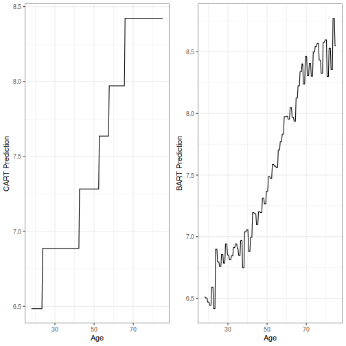

This notebook reproduces some of the Figures displayed in Chapter 5 (tree-based
methods and Bayesian additive regression trees). First, we load required
packages.


```r
library(CausalBNPBook)
library(tidyverse)
library(splines)
library(BART)
library(rpart)
library(xgboost)
library(randomForest)
library(gbm)
```

We use a subset of the MEPS dataset that is included in the __CausalBNPBook__
package:


```r
data(meps)

meps <- meps %>% as_tibble %>% mutate(y = log(y))
meps_age <- meps %>% select(age, y)
meps_age_test <- tibble(age = seq(from = min(meps$age),
                                  to = max(meps$age),
                                  length = 200))
```

# Reproducing Figure 5.6

The following code fits a CART model (using the __rpart__ package) and a BART
model (using the __BART__) package. Results are then compared for predicting log
medical expenditures from age on MEPS.


```r
set.seed(19084)

fitted_cart <- rpart(y ~ age, data = meps_age, cp = .001)
meps_age_test$cart_pred <- predict(fitted_cart, meps_age_test)

## Fit BART ----

fitted_bart <- wbart(x.train = select(meps_age, -y) %>% as.data.frame(),
                     y.train = meps_age$y,
                     x.test = meps_age_test %>% as.data.frame())
```

The following plots the results


```r
meps_age_test$bart_pred <- fitted_bart$yhat.test.mean

p_1 <- ggplot(meps_age_test, aes(x = age, y = cart_pred)) +
  geom_line() +
  xlab("Age") +
  ylab("CART Prediction") +
  theme_bw()

p_2 <- ggplot(meps_age_test, aes(x = age, y = bart_pred)) +
  geom_line() +
  xlab("Age") +
  ylab("BART Prediction") +
  theme_bw()

gridExtra::grid.arrange(p_1, p_2, nrow = 1)
```



# Reproducing Figure 5.8

Next, we reproduce Figure 5.8, which compares the predictions from a random
forest to the predictions from an ensemble of decision trees fit through
gradient boosting. The same subset of MEPS is used. We first fit the models.


```r
set.seed(843592734)

test_df <- tibble(age = seq(from = 20, to = 100, length = 500))

## Fit RF ----

fitted_rf <- randomForest(x = meps %>% select(age), y = meps$y)
pred_rf <- predict(fitted_rf, test_df)

## Fit boosting ----

fitted_boost <- gbm(y ~ age, data = meps, distribution = "gaussian")
pred_boost <- predict(fitted_boost, test_df, n.trees = 200)
```

```
## Warning in predict.gbm(fitted_boost,
## test_df, n.trees = 200): Number of
## trees not specified or exceeded
## number fit so far. Using 100.
```

We then use __tidyverse__ to plot the results:


```r
results_df <- tibble(age = rep(test_df$age,2),
                     fage = c(pred_rf, pred_boost),
                     method = rep(c("Random Forests", "Boosting"),
                                  each = nrow(test_df)))

ggplot(results_df, aes(x = age, y = fage)) +
  geom_line() +
  facet_wrap(~method) +
  xlab("Age") +
  ylab("Prediction") +
  theme_bw()
```


