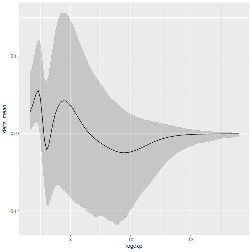
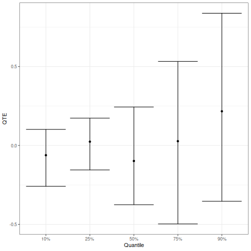

# Introduction

The Medical Expenditure Panel Survey (MEPS) provides extensive data for health
services research. In this analysis, we focus on understanding the quantile
treatment effects (QTE) of smoking on medical expenditures using the BART-DPM
approach described in Chapter 8. Through the QTE, we gain insights not just into
the average effect but also into how treatment effects vary across different
percentiles of the outcome distribution.

# Required Libraries and Data

We begin by ensuring necessary libraries are installed and loaded. Note that
this requires the **BNPqte** package, which may require downloading the source
code directly from the linked GitHub repository
(https://github.com/chujiluo/BNPqte) and installing manually (as well as the
**tidyverse** package).


```r
library(CausalBNPBook)
library(tidyverse)
library(BNPqte)
```

# Data Preparation

To ensure reproducibility, we set a seed. We then take a subset of 1000 records
from the MEPS dataset for demonstration. The outcome `y` is transformed using a
logarithm, and covariates are extracted into a matrix `x`. Note for posterity
that the `qte` function we use below requires that the `x` matrix have only
non-constant columns; hence, we remove the intercept in creating the design
matrix.


```r
set.seed(20983)

meps <- CausalBNPBook::meps
idx <- sample(seq_len(nrow(meps)), 1000)

y <- log(meps$y + 1000)[idx]
x <- model.matrix(~age + sex + race + loginc + 
                    marriage + seat_belt + edu - 1, 
                  data = meps[idx,])
a <- meps$smoke[idx]
```

# QTE Estimation

We utilize the `qte` function from the `BNPqte` package to estimate the quantile
treatment effects. This just requires supplying the outcome `y`, the covariate
matrix `x` (excluding the treatment), and the treatment indicator `a`.


```r
set.seed(20912)
meps_qte <- qte(y = y, x = x, treatment = a)
```

```
## ---------------------------------
##  Modeling Treatment ~ Confounders
## ---------------------------------
## *****Into main of pbart
## *****Data: n, p, np: 1000, 22, 0
## *****BinaryOffset: -1.112321
## *****Number of Trees: 50
## *****Prior: split.prob, mybeta, alpha, tau: polynomial, 2, 0.95, 0.212132
## *****Dirichlet: sparse, theta, omega, a, b, rho, augment: 0, 0, 1, 0.5, 1, 22, 0
## *****MCMC: (train) nskip, ndpost, keepevery: 500, 5, 100
##            (test) nskip, ndpost, keepevery: 500, 5, 100
## -------BART fit 0 out of 1000
## -------BART fit 100 out of 1000
## -------BART fit 200 out of 1000
## -------BART fit 300 out of 1000
## -------BART fit 400 out of 1000
## -------BART fit 500 out of 1000
## -------BART fit 600 out of 1000
## -------BART fit 700 out of 1000
## -------BART fit 800 out of 1000
## -------BART fit 900 out of 1000
## Time elapsed: 2s
## BART Finished!
## -------------------------------
##  Modeling Outcome ~ PS
## -------------------------------
## *****Into main of Weight-Dependent DPMs
## *****Data: n0(control), n1(treatment): 867, 133
## *****Prediction: type, ngrid, nxpred: cdf, pdf, 100, 1000
## *****Distribution of PS is estimated by Bayesian bootstrap
## *****Posterior sampling method: Blocked Gibbs Sampling with 50 clusters
## *****Prior: updateAlpha, useHyperpriors: TRUE, TRUE
## *****MCMC: nskip, ndpost, keepevery: 500, 200, 2
## *****Number of DPMs: 10 
## -------DPM fit 2 out of 10 
## -------DPM fit 4 out of 10 
## -------DPM fit 6 out of 10 
## -------DPM fit 8 out of 10 
## -------DPM fit 10 out of 10 
## DPM Finished!
## Collecting returns ...Finished!
```

# Visualizing Treatment Effects

A comprehensive visualization allows for a better understanding of the treatment
effects. We first visualize the differences in CDFs between the treated and
control groups across various expenditure levels. To do this, we note that the
objects `treatment.cdfs` and `control.cdfs` contain posterior samples of the
CDFs of the potential outcomes for each iteration along a grid contained in
`grid`. We use **tidyverse** functions to format the results into a single data
frame `results`:


```r
results <- tibble(
  logexp = rep(meps_qte$grid, each = nrow(meps_qte$control.cdfs)),
  trt_cdf = as.numeric(meps_qte$treatment.cdfs),
  ctr_cdf = as.numeric(meps_qte$control.cdfs)
) %>%
  mutate(delta = trt_cdf - ctr_cdf)

head(results)
```

```
## # A tibble: 6 × 4
##   logexp trt_cdf ctr_cdf   delta
##    <dbl>   <dbl>   <dbl>   <dbl>
## 1   6.64 0.00318 0.00101 0.00217
## 2   6.64 0.0165  0.00122 0.0153 
## 3   6.64 0.0223  0.00198 0.0203 
## 4   6.64 0.0156  0.00373 0.0118 
## 5   6.64 0.0517  0.00211 0.0495 
## 6   6.64 0.0146  0.00200 0.0126
```

We then summarize the results using **tidyverse** functions and plot the results
for the difference in CDFs:


```r
results_sum <- results %>%
  group_by(logexp) %>%
  summarise(delta_mean = mean(delta),
            delta_min = quantile(delta, 0.025),
            delta_max = quantile(delta, 0.975))

ggplot(results_sum, aes(x = logexp)) +
  geom_line(aes(y = delta_mean)) +
  geom_ribbon(aes(ymin = delta_min, ymax = delta_max), alpha = 0.2)
```



# Differences in Quantiles

Finally, we visualize how the treatment effect varies across different
quantiles. The `qte` function returns the posterior mean and a 95% credible
interval for the quantile treatment effects at various percentiles. The
following code creates a data frame `qt_df` containing the estimated quantiles
for the treatment and control groups, as well as the quantile treatment effect,
along with the posterior intervals.


```r
get_qt_df <- function(j) {
  tibble(
    variable = c("Treated", "Control", "Difference"),
    mean = c(meps_qte$treatment.quantiles.avg[j],
             meps_qte$control.quantiles.avg[j],
             meps_qte$qtes.avg[j]),
    lcl = c(meps_qte$treatment.quantiles.ci[j,1],
            meps_qte$control.quantiles.ci[j,1],
            meps_qte$qtes.ci[j,1]),
    ucl = c(meps_qte$treatment.quantiles.ci[j,2],
            meps_qte$control.quantiles.ci[j,2],
            meps_qte$qtes.ci[j,2]),
    quantile = names(meps_qte$qtes.avg)[j]
  )
}

qt_df <- do.call(rbind, lapply(1:5, get_qt_df))

head(qt_df)
```

```
## # A tibble: 6 × 5
##   variable      mean    lcl   ucl quantile
##   <chr>        <dbl>  <dbl> <dbl> <chr>   
## 1 Treated     6.99    6.80  7.16  10%     
## 2 Control     7.05    7.03  7.08  10%     
## 3 Difference -0.0618 -0.259 0.102 10%     
## 4 Treated     7.31    7.16  7.46  25%     
## 5 Control     7.29    7.22  7.35  25%     
## 6 Difference  0.0239 -0.155 0.173 25%
```

Finally, we plot the result:


```r
qt_df %>% filter(variable == "Difference") %>%
  ggplot(aes(x = quantile)) +
  geom_point(aes(y = mean)) +
  geom_errorbar(aes(ymin = lcl, ymax = ucl)) +
  xlab("Quantile") +
  ylab("QTE") +
  theme_bw()
```



# Conclusion

Through this analysis, we see how smoking affects medical expenditures across
different quantiles. The findings here are largely consistent with the analysis
done using BART, where a large total effect of smoking on health care
expenditures is not supported at any choice of quantile. Of course, this
analysis uses only a subset of the data, and also does not perform a mediation
analysis using health status as a mediator (which is shown in the book to be
very important in identifying the causal effect of smoking on expenditures).
